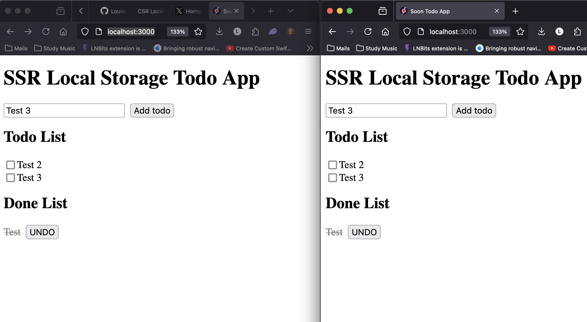

# Todo App with Leptos SSR and Local Storage

This is a very simple Todo App in Leptos that demonstrates how to use local storage in a SSR ( Server Side Rendering ) environment without any external dependencies.

## Running the App

* Set up rust nightly with `rustup override set nightly`
* Run `cargo leptos watch`
